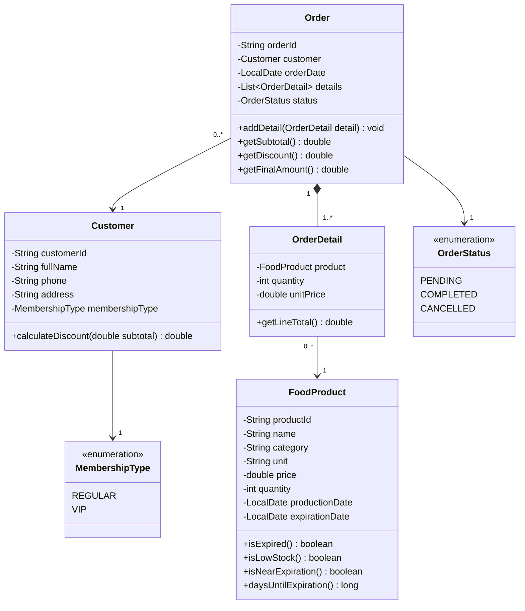

# Food Store Manager

> Java OOP console app to manage a food store: products, customers, sales, inventory and reports.

## About

Food Store Manager is a console-based application that helps a medium-sized food store manage its products, customers, sales transactions and inventory.

The project is developed as a Project-Based Learning (PBL) assignment at FPT University. It applies Object-Oriented Programming and Computational Thinking throughout the process, from requirements analysis and UML design to implementation.

## The Problem

The store currently tracks stock and sales by hand, which leads to three recurring issues:

- **Stock numbers drift**, so products run out unexpectedly
- **Expired products get sold**, causing health risks and complaints
- **Totals are calculated wrong**, leading to revenue loss and disputes

This system aims to solve all three by keeping inventory accurate, blocking expired items at checkout and computing every total automatically.

## Scope

The application is planned to cover five areas:

| Area | Description |
|---|---|
| Food Products | Manage product information, prices, stock and expiration dates |
| Customers | Manage customer information and Regular or VIP membership |
| Sales | Create transactions, apply membership discounts and confirm sales |
| Inventory | Update stock automatically and alert on low-stock or expiring items |
| Reports | Generate sales reports, best-selling products and top customers |

## Our Approach

The system is designed using the four pillars of Computational Thinking:

| Skill | How it is applied |
|---|---|
| **Decomposition** | Break the store into five modules, each with a clear responsibility |
| **Abstraction** | Keep only the data that supports business rules and leave out the rest |
| **Pattern Recognition** | Identify the shared CRUD pattern across products, customers and orders |
| **Generalization** | Build class hierarchies so new customer types can be added without rewriting logic |

## UML Class Diagram

> **Note:** This is the initial design from the analysis phase. It will evolve as the project grows, with new classes, inheritance and relationships added in later stages.

Getters, setters and constructors are omitted for readability.

### Relationships

| Relationship | Type | Meaning |
|---|---|---|
| Order → Customer | Association | Each order belongs to one customer. A customer can have many orders. |
| Order ◆ OrderDetail | Composition | An order contains one or more lines. Lines cannot exist without their order. |
| OrderDetail → FoodProduct | Association | Each line refers to one product. A product can appear in many lines. |

### Design Highlights

- **Four core entities.** Inventory lives in the `quantity` field of `FoodProduct`, and reports are calculated from completed orders. This keeps a single source of truth for every piece of data.
- **Price snapshot.** `OrderDetail` stores the price at the moment of sale, so past invoices stay correct even when product prices change.
- **Immutable IDs.** Product, customer and order IDs are `final` with no setter, so they can never be changed after creation.
- **Protected collections.** An order's items can only be added through `addDetail()`. External code receives a copy, never the original list.
- **Ready to extend.** Discount logic sits inside `Customer`, so new membership tiers can be introduced later without touching `Order`.

## Key Business Rules

| Rule | Description |
|---|---|
| Unique IDs | Product and customer IDs are unique and cannot be modified |
| Valid data | Price must be greater than zero and stock cannot be negative |
| Date check | Production date cannot be after the expiration date |
| Stock check | Quantity sold cannot exceed available stock |
| Expiry check | Expired products cannot be sold |
| Pricing | Total = Sum of (Price x Quantity), Final = Total minus Discount |
| Membership | Regular customers get no discount, VIP customers get 10% |
| Alerts | Low stock at 5 items or fewer, near expiry at 7 days or fewer |
| Revenue | Only completed transactions count toward revenue |

## Future Development

The design leaves room to grow. Planned and potential improvements include:

**Within the course**
- Management classes for full CRUD operations
- Input validation and a menu-driven console interface
- Customer hierarchy with polymorphic discount calculation
- File-based data persistence and exception handling
- Sales reports and analytics

**Beyond the course**
- More membership tiers such as Silver, Gold and Platinum
- Promotions, vouchers and seasonal discounts
- Supplier and purchase order management
- Database storage with MySQL or SQL Server
- Graphical interface with Java Swing or JavaFX
- Multi-user support with staff roles and permissions
- Barcode scanning for faster checkout

## Tech Stack

| Category | Technology |
|---|---|
| Language | Java 8 |
| IDE | Apache NetBeans 13 |
| Date & Time | `java.time` API |
| Design | UML Class Diagram |
| Version Control | Git & GitHub |

## Team

**Group 06** · Class SE2113 · FPT University HCMC

| Member | Student ID |
|---|---|
| Phạm Hoàng Tuấn (Leader) | SE200947 |
| Nguyễn Thiện Nhân | SE211217 |
| Huỳnh Minh Trung | SE194701 |
| Dương Trọng Chánh | SE211578 |

**Lecturer:** Hồ Hoàn Kiếm

---

Group 06 · FPT University HCMC
